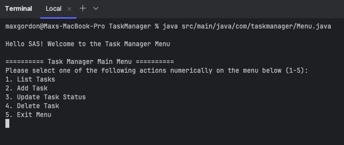
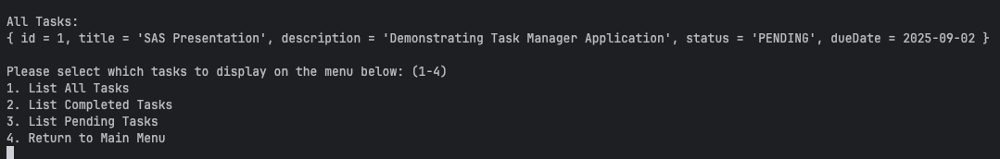
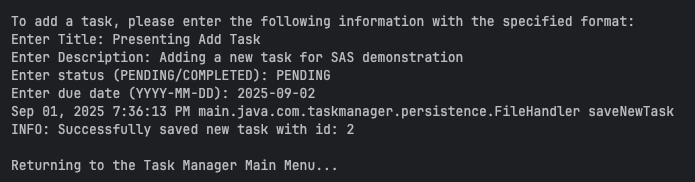
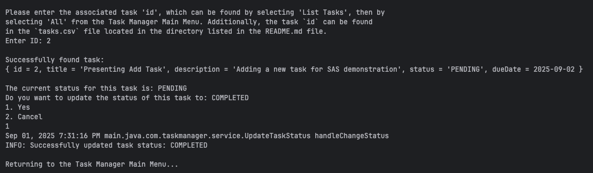
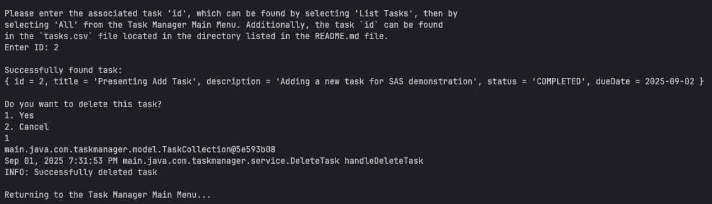
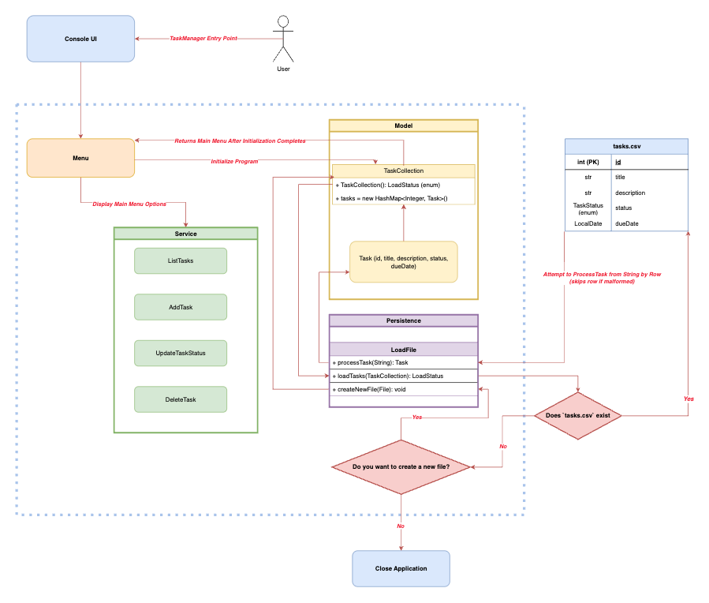
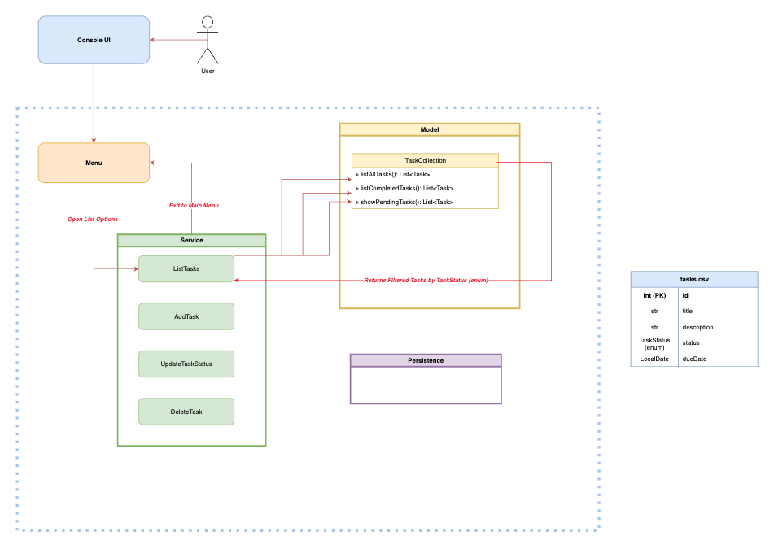
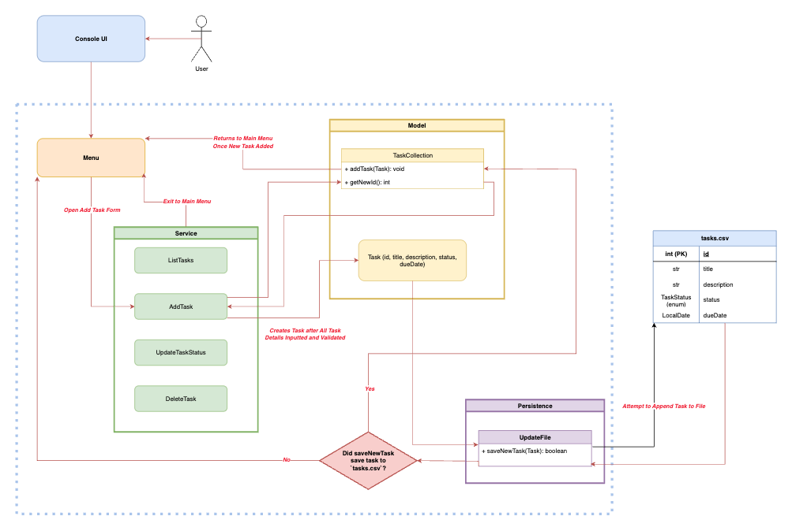
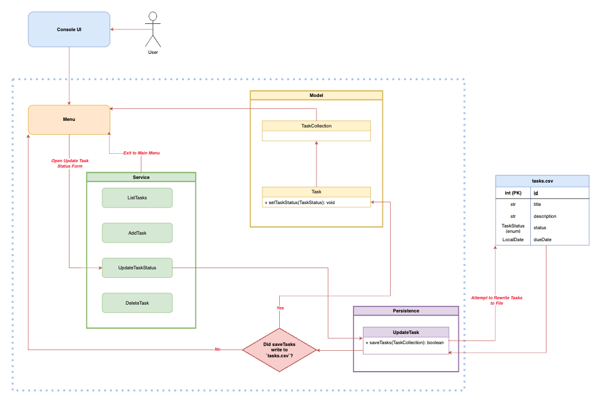
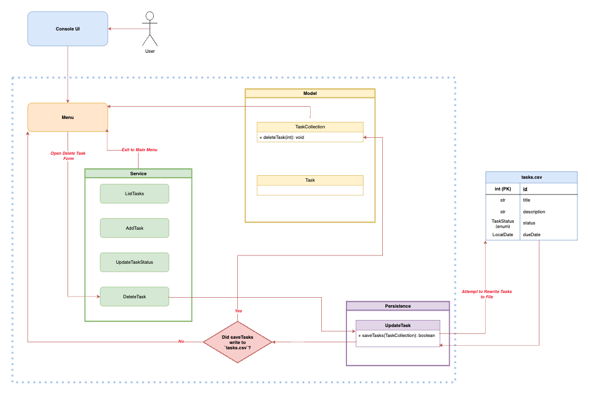

# Task Manager Presentation 

## Agenda

1. **Application Demonstration**
   1. Execute program
   2. List tasks
   3. Add new task
   4. Update task status
   5. Delete task  

2. **System Design and Implementation**
   1. Walkthrough application workflow
   2. Review code repository

3. **Trade-offs & Challenges**
   1. Database design decisions 
   2. Repository setup & scaling considerations

4. FAQ
   1. Answer any remaining questions

---

## Application Demonstration

### Main Menu

---

### List All Tasks

---

### Add Task

---

### Update Task Status

### Delete Task

---

##  System Design and Implementation

### Program Execution

---

### List Tasks

---

### Add Task

---

### Update Task Status

---

### Delete Task

---

## Tradeoffs & Challenges

### Database Design Decisions

Non-atomic data when application loads

- Skips writing malformed rows to `TaskCollection`
- Avoids blocking all tasks from loading into local memory if one task is malformed
- However, creates a mismatch between `tasks.csv` and `TaskCollection`
- Additionally, if `TaskCollection` contains a duplicate key, it will overwrite previously stored task locally

Solution implemented: log warning messages

- To avoid application closure, TaskManager will still run as expected with successfully
    processed tasks from `task.csv`
- Tasks that are malformed or overwritten due to duplicate ids are logged as warnings for debugging
- A warning message appears saying if the `tasks.csv` file is not updated and re-loaded before proceeding, 
    any tasks not processed will risk being permanently lost upon file updates

Atomicity after application execution

* `TaskCollection` changes are rolled back to previous state if CSV updates fail
  * This ensures continuity between local storage and `tasks.csv`
* Errors are logged based on issue to help debug

Application closure versus logging

* Closing application when `tasks.csv` file isn't created on program initiation
  * Exit application if there is a severe issue preventing application from running
* Log warnings or errors when application can still function and preserve `tasks.csv` 

### Repository Setup & Scaling Considerations

Database scaling

* Small amount of tasks, works well with CSV, able to view and edit easily in Excel
* If task data grows in complexity, i.e. multiple variations of Tasks, could convert to JSON
* If task database becomes very large, could utilize NoSQL / MySQL database connector / cloud service 

Model complexity

* If tasks become more complex, could utilize interfaces or abstract classes to enforce required task functionality
* Can create new task types, user groups, etc.

---

## FAQ
* Thank you for your time SAS!

---